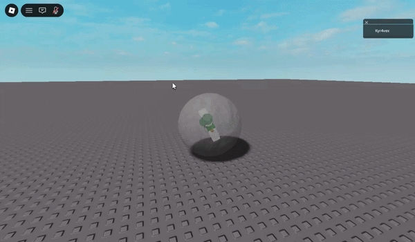

# Roblox Ball Movement System

A physics-based locomotion system that allows players to move inside a controllable rolling sphere.

## Features
* **Physics Locomotion:** Smooth rolling mechanics utilizing Roblox physics engine.
* **Easy Setup:** Distributed as a single `.rbxmx` model for drag-and-drop integration.

## Installation
1. Download `BallSystem.rbxmx` from this repository.
2. Drag and drop the file into your **Roblox Studio** workspace.
